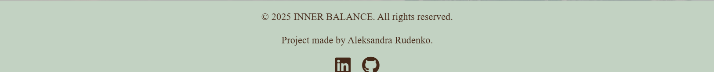

# **INNER BALANCE**

[View live project here!]()

INNER BALANCE is a personal wellness tracker built with **Django**, **Bootstrap**, and **JavaScript** and database. Track daily tasks, water intake, and sleep hours, see progress bars with motivational messages, and get an automatic daily reset so every day starts clean.

## Content:
- [User Goals](#user-goals)  
- [Business Goals](#business-goals)  
- [Developer Goals](#developer-goals)  
- [User Stories](#user-stories)  
- [Design Choices](#design-choices)  
- [Features](#features)  
- [UX Design](#ux-design)  
- [Technologies Used](#technologies-used)  
- [Testing](#testing)  
- [Bugs](#bugs) 
- [Future Changes](#future-changes)
- [Deployment](#deployment)  
- [Publishing](#publishing)  
- [Credits](#credits)  

## User Goals
The website helps users build healthy daily habits with a simple, motivating flow.

#### Users should be able to:
- Create, complete, and delete daily tasks.
- See progress and motivational messages based on completion %.
- Track water intake and sleep against personal goals.
- View everything clearly on mobile and desktop.

## Business Goals
INNER BALANCE is designed to be more than just a personal project — it’s a demonstration of practical, real-world web development skills. 
The project aims to:
- Provide a polished, professional example for a development portfolio.  
- Show the ability to build a complete, functional product from backend to frontend.  
- Deliver a user experience that feels smooth, reliable, and visually appealing.  
- Be easily extendable for future features, making it a potential foundation for a real wellness tool.

## Developer Goals
- Build a fully functional wellness tracker using Django, HTMX, Tailwind CSS, and JavaScript.  
- Ensure the application is fully responsive and works seamlessly across devices.  
- Implement clean, maintainable, and scalable code that follows best practices.  
- Optimize both backend and frontend performance for a fast and smooth user experience.  
- Create a solid foundation that can be expanded with new wellness-related tools in the future.

## User Stories

### 1. Sign-Up
**As a new user**, I want to create an account **so that I can track my wellness habits**.

**Acceptance Criteria:**
- A sign-up form is available with fields for username and password.  
- On successful registration, I’m redirected to the login page.  
- An error message appears if passwords don’t match or if the username already exists.  

### 2. Login
**As a returning user**, I want to log in to my account **so that I can securely access my personalized wellness dashboard and saved data**.

**Acceptance Criteria:**
- The login form includes fields for username/email and password.  
- If credentials are correct, I am redirected to the dashboard.  
- If credentials are incorrect, an error message is displayed (e.g., *"Invalid email or password"*).  
- Users who are not logged in cannot access protected pages (e.g., dashboard, profile).  
- A "Forgot Password?" link is available for password resets.  
- The user remains logged in during the session until they log out or become inactive.  

### 3. Creating Tasks
**As a logged-in user**, I want to create my own personalized daily wellness tasks **so that I can track them every day**.

**Acceptance Criteria:**
- After first login (or via dashboard), the user is prompted to create a daily task list.  
- A new task can be added by entering a title (e.g., *"Drink 2L water"*, *"Meditate 10 minutes"*).  
- Tasks can be edited or deleted after creation.  
- The system validates that task names are not empty.  
- A user can create multiple tasks in one session.  
- Tasks are saved in the user's profile and displayed in their daily dashboard.  

### 4. Marking Tasks as Completed
**As a user**, I want to mark tasks as completed **so that I can track my progress and focus on remaining tasks**.

**Acceptance Criteria:**
- Each task has a checkbox or toggle for completion.  
- Completed tasks are visually distinct (e.g., crossed out or faded).  
- The user can toggle completion status on and off.  

### 5. Motivational Feedback
**As a user**, I want to receive positive feedback when I do well **so that I stay motivated**.

**Acceptance Criteria:**
- If I complete 80% or more of my tasks, a motivational message appears.  
- If I complete less, a different type of message appears to encourage me to improve.  

### 6. Water Intake Tracking
**As a user**, I want to track my daily water consumption **so that I can meet my hydration goals**.

**Acceptance Criteria:**
- I can set a daily water intake goal.  
- I can increase or decrease my water count with buttons.  
- The progress bar updates automatically as I log water intake.  
- A motivational message appears based on how close I am to my goal.  

### 7. Sleep Tracking
**As a user**, I want to track my daily sleep hours **so that I can monitor my rest patterns**.

**Acceptance Criteria:**
- I can set a daily sleep goal in hours.  
- I can input the number of hours I slept.  
- The progress bar updates automatically as I log sleep.  
- A motivational message appears based on how close I am to my goal.  

## Design Choices

**Wireframes:**

**Project Plan:**
The original concept for INNER BALANCE was to create a fully-featured wellness tracking application with multiple modules (tasks, water intake, sleep tracking, and motivational feedback). The focus shifted towards building a **clean, minimal, and functional app** that delivers the essential daily tracking experience while laying the foundation for future features like priority setting, reminders, and analytics.

## Features

### Navigation
- A fixed navigation bar on all pages containing the INNER BALANCE logo.  
- Links to Dashboard, Profile, and Logout for easy navigation.  
- Navigation adapts for mobile with a compact menu.

  
  

### Overview
- Central hub showing all daily wellness stats and tools.  
- Displays:
  - **Daily Task List** with checkboxes to mark completion.  
  - **Water Intake Tracker** with progress bar.  
  - **Sleep Hours Tracker** with progress bar.  
  - Motivational feedback messages based on progress.  

  

### Task Management
- Create, edit, and delete personalized daily wellness tasks.  
- Task validation ensures non-empty names.  
- Completed tasks are visually distinct (e.g., faded or crossed out).  
- Future feature: set task priority levels.  

  

### Water Intake Tracking
- Set a daily water goal in liters.  
- Add or remove units of water intake.  
- Progress bar updates dynamically.  
- Motivational messages encourage meeting daily hydration goals.  

  

### Sleep Tracking
- Set a daily sleep goal in hours.  
- Log the number of hours slept.  
- Progress bar shows completion percentage.  
- Feedback messages promote healthy rest habits.  

  

### Motivational Feedback
- Displays encouraging messages based on task completion and goal progress.  
- Different messages appear for high performance vs. low completion.  

  

### Daily Reset (Automatic)
- At the start of each day:
  - All tasks are reset to incomplete.  
  - Water intake resets to 0.  
  - Sleep hours reset to 0.  
- This ensures the dashboard is fresh each day.  

### Footer
- Displays project credits and copyright.  

  

### 404 Error Handling (Defensive Design)
- Friendly error page matching INNER BALANCE branding.  
- Suggests returning to the dashboard or logging in.  
- Helps guide lost users back to the main workflow.  

  

## UX Design
The design of INNER BALANCE focuses on **minimalism, clarity, and motivation**.  
The aim is to keep the interface clean and distraction-free while still engaging users with visual progress indicators and positive feedback.

### Colors and Theme
**Color Scheme:**
- **Primary Color:** `#442818` — A rich brown that conveys stability and grounding, used for headings, primary buttons, and key UI elements.
- **Secondary Color:** `#7e533b` — A warm, earthy brown that complements the primary color and provides visual hierarchy.
- **Highlight Color:** `#c2d2c2` — A soft eucalyptus green used for accents, highlights, and subtle emphasis.
- **Highlight Color (Dark):** `#2D4739` — A deep green for contrast elements, hover effects, and secondary emphasis.

  

### Fonts
- **Primary Font:** `"Instrument Serif", serif` — Elegant yet readable, adding a touch of sophistication to the minimalist UI.

### Effects and Interactions
INNER BALANCE uses a mix of subtle animations, dynamic feedback, and conditional rendering to create an engaging yet minimal wellness tracking experience.

- **Progress Bar Animations:**
  - Task, water, and sleep progress bars smoothly fill as users complete goals.
  - Percentages update instantly to reflect changes.

- **Motivational Text Updates:**
  - Encouraging messages change dynamically based on task completion percentage.
  - Different messages for high achievement, mid-progress, and low activity.

- **Collapsible Task List:**
  - Users can toggle the daily task list open/closed with an arrow icon.
  - Arrow icon flips direction when toggled for intuitive interaction.

- **Modal Popups:**
  - Clicking edit or view on a task opens a modal with task details.
  - Modals allow in-place editing without leaving the dashboard.

- **Live Counters:**
  - Water intake and sleep tracking update in real time.
  - Plus/minus buttons instantly adjust counts without a page reload.

- **Form Validation Feedback:**
  - Task creation checks for empty names before saving.
  - Error messages appear instantly if validation fails.

- **Conditional UI Changes:**
  - Sign-up prompts are hidden for logged-in users.
  - Dashboard modules adjust automatically based on whether data exists.

- **Subtle Hover Effects:**
  - Buttons, icons, and interactive elements slightly change color or scale on hover to indicate interactivity.

- **Responsive Card Layout:**
  - On mobile devices, dashboard modules stack vertically and remain fully interactive.

### Accessibility
- Adequate contrast between text and background.  
- Large, clickable buttons for mobile use.  
- Font sizes optimized for all devices.

### Responsiveness
- Fully responsive design adapting to desktop, tablet, and mobile layouts.  
- Dashboard elements stack vertically on small screens for ease of use.

## Technologies Used

- **HTML** — Structures the content of the application, including forms, navigation, and dashboard elements.
- **CSS** — Styles the application with custom layouts, colors, typography, and responsive design.
- **CSS Variables** — Used for managing a consistent color palette and font settings across the project.
- **CSS Flexbox** — Provides flexible and responsive layouts for dashboard components and forms.
- **Bootstrap 5** — Delivers responsive design and pre-built components like modals, buttons, and form controls.
- **JavaScript (Vanilla)** — Handles task logic, dynamic updates, progress bar animations, conditional UI rendering, and dashboard interactions.
- **jQuery** — Simplifies DOM manipulation, event handling, and animations (used in some legacy interactions).
- **Django** — The backend framework powering the app, managing templates, routes, models, and authentication.
- **PostgreSQL** — Relational database used in production for storing tasks, water/sleep tracking data, and user profiles reliably and securely.
- **Git** — Version control for tracking changes and managing development history.
- **GitHub** — Hosts the repository and enables collaboration and deployment.
- **Font Awesome** — Provides vector-based icons for buttons, navigation, and UI feedback.
- **Google Fonts** — Integrates `"Instrument Serif"` for typography consistency.
- **Visual Studio Code** — Code editor for development with extensions for Django, Git, and formatting.
- **Coolors** — Assisted in creating a harmonious and professional color palette.
- **Image Optimization Tools** — Used to compress and resize static images for faster page loading.

## Testing 
### User stories tasting:

| **Test Description**                                                        | **Result** | **Status** |
|------------------------------------------------------------------------------|------------|------------|
| User can sign up, log in, and log out successfully.                          | Pass       | ✅         |
| User can create a task with title and description.                           | Pass       | ✅         |
| User cannot create a task with duplicate title.                              | Pass       | ✅         |
| User can edit their own task and see changes immediately.                    | Pass       | ✅         |
| User can delete their own task with confirmation.                            | Pass       | ✅         |
| User can update water and sleep intake within allowed range (0–20).          | Pass       | ✅         |
| User cannot update water or sleep intake outside allowed range.              | Pass       | ✅         |
| User can set water and sleep goals within allowed range (1–20).              | Pass       | ✅         |
| Daily reset resets tasks, water, and sleep at start of new day.              | Pass       | ✅         |
| Non-logged-in users are redirected to login when accessing protected pages.  | Pass       | ✅         |
| 404 page is shown for non-existent routes in production.                     | Pass       | ✅         |

### Manual testing results:

###  Sign Up
| **Form Testing** | **Description**                                                                          | **Result** | **Status** |
|------------------|------------------------------------------------------------------------------------------|------------|------------|
|                  | Accepts unique username/email + strong password; user is created & logged in.           | Pass       | ✅         |
|                  | Duplicate **username** is rejected with a field error.                                   | Pass       | ✅         |
|                  | Password confirmation mismatch shows a field error.                                      | Pass       | ✅         |
|                  | Required fields enforced; empty submit shows field errors.                               | Pass       | ✅         |
|                  | 'tracker/overview' preserved and user redirected there after signup.                     | Pass       | ✅         |

### Login
| **Form Testing** | **Description**                                                | **Result** | **Status** |
|------------------|----------------------------------------------------------------|------------|------------|
|                  | Valid credentials log user in and redirect to overview.        | Pass       | ✅         |
|                  | Invalid credentials show an error; user remains on login page. | Pass       | ✅         |

### Logout
| **Form Testing** | **Description**                                                   | **Result** | **Status** |
|------------------|-------------------------------------------------------------------|------------|------------|
|                  | Logout link ends session and redirects to home/landing page.      | Pass       | ✅         |
|                  | Visiting homepage after logout redirects to login page.           | Pass       | ✅         |

###  Profile
| **Form Testing** | **Description**                                                                                   | **Result** | **Status** |
|------------------|---------------------------------------------------------------------------------------------------|------------|------------|
|                  | Updating **water goal** with valid value between 1–20 saves successfully.                         | Pass       | ✅         |
|                  | Updating **sleep goal** with valid value between 1–20 saves successfully.                         | Pass       | ✅         |
|                  | Invalid values outside allowed range trigger error message.                                       | Pass       | ✅         |
|                  | Description can be updated (max 500 characters).                                                  | Pass       | ✅         |
|                  | Leaving description empty saves successfully.                                                     | Pass       | ✅         |
|                  | Comma in numeric input is accepted and converted to decimal.                                      | Pass       | ✅         |
|                  | Submitting form without changes keeps previous values.                                            | Pass       | ✅         |

###  Overview
| **Form Testing** | **Description**                                                                                   | **Result** | **Status** |
|------------------|---------------------------------------------------------------------------------------------------|------------|------------|
|                  | New task can be created with title ≤ 50 characters and description ≤ 200 characters.              | Pass       | ✅         |
|                  | Attempting to add task with duplicate title shows error message.                                   | Pass       | ✅         |
|                  | Task can be marked as complete and saved.                                                          | Pass       | ✅         |
|                  | Task list refreshes daily at reset time, resetting completion status.                              | Pass       | ✅         |
|                  | Water intake and sleep hours can be updated (0–20 range enforced).                                 | Pass       | ✅         |
|                  | Invalid intake values outside range trigger error message.                                         | Pass       | ✅         |

#### Lighthouse Report:

### Compatibility
In order to confirm the correct functionality, responsiveness, and appearance:

The website was tested on the following browsers: Chrome, Mozilla Firefox, Microsoft Edge.
- **Chrome:**  

- **Mozilla Firefox:**

- **Microsoft Edge:**

### Responsiveness

The website was checked with Responsive Website Design Tester.

- **Main Page:**

- **Meet Characters Chapter:**

- **Story Chapters:**

- **Puzzle Game:**

### Validator Testing 

#### HTML 

  - **Index.html:** 

  

#### CSS

  - **Style.css:**

  

##### JS

  - **Script.js:**

   

## Bugs

### Solved Bugs

#### CSS & Asset Loading Issues
- **Issue:** After deployment, CSS styles and banner images were missing, causing the homepage design to break.
- **Cause:** Static files were not being properly collected and referenced in production.
- **Fix:** Configured Django `STATICFILES_DIRS` and ran `collectstatic` before deployment. Updated template paths to use `` for all assets.

#### JavaScript DOM Selection Errors
- **Issue:** `document.getElementsByClassName(...).forEach` threw an error because `getElementsByClassName` returns an HTMLCollection, not an array.
- **Fix:** Changed to `document.querySelectorAll()` which returns a NodeList that supports `.forEach()`.

- **Issue:** `checkboxes.filter is not a function` in `Motivation()` function.
- **Cause:** `document.querySelectorAll()` returns a NodeList, which doesn’t have `.filter()`.
- **Fix:** Converted NodeList to an array using `Array.from(checkboxes)` before filtering.

#### jQuery / Vanilla JS Conflicts
- **Issue:** Elements like task list toggles and progress updates were breaking because `slideToggle()` and `.hasClass()` are jQuery-only methods but were called on vanilla JS elements.
- **Fix:** Either replaced with pure JavaScript equivalents or ensured jQuery selectors were used for these elements.

#### Modal & Image Display Issues
- **Issue:** After adding new UI functions, character images and modals stopped working.
- **Fix:** Switched from direct event binding (`$('.class').click(function)`) to delegated binding with `$(document).on('click', '.class', function)` so dynamically loaded elements remained interactive.

#### Progression & State Bugs
- **Issue:** Task completion percentage and motivational text sometimes showed incorrect values.
- **Cause:** Event listeners weren’t re-initialized after DOM changes.
- **Fix:** Re-attached listeners after updating the DOM and ensured calculations were run on page load.

- **Issue:** Water and sleep tracking inputs were not updating progress bars correctly.
- **Fix:** Adjusted selector logic and value parsing to handle missing or invalid input values.

### Unfixed / Known Bugs

- No unfixed bugs found.

## Future Changes

The following features and improvements could be done for INNER BALANCE to enhance functionality, performance, and user experience:

- **Expanded Wellness Tracking:** Add more customizable task categories (e.g., nutrition, exercise, mindfulness) with detailed tracking options.
- **Task Prioritization:** Allow users to assign priority levels (e.g., High, Medium, Low) to their daily tasks, enabling better focus on what matters most.
- **Gamification Elements:** Introduce badges, streak counters, and level progression to boost motivation and user engagement.
- **Improved Progress Analytics:** Provide charts and reports that show trends over time for tasks, water intake, and sleep.
- **Refactored JavaScript:** Streamline and optimize the code by removing unnecessary repetition, improving variable reuse, and reducing DOM lookups.
- **Remove jQuery Dependency:** Transition all scripts to pure JavaScript for better performance and maintainability.
- **Push Notifications / Reminders:** Enable daily reminders to log tasks, drink water, and update sleep hours.
- **Resources App:** Create a dedicated section with wellness-related blog posts, tips, and expert advice to educate and inspire users.
- **Goal Setup at Registration:** Add the ability for users to set their daily water intake and sleep goals during the sign-up process, ensuring a personalized dashboard from day one.

https://www.freepik.com/free-photos-vectors/notepad-transparent-background -for notepad picture

Bugs:
Everytime after pressing on checkboxes in rolls you up to progress container.-not fixed
Fix the bug with progress-bar-fill dissapearing from the screen" -fixed by impproving html structure of progress bar.
