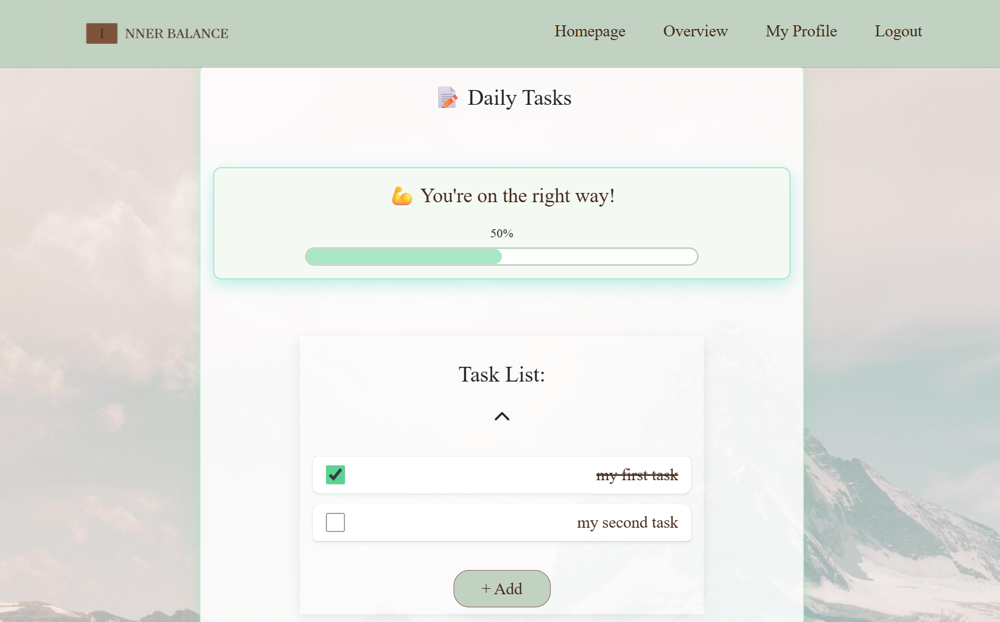

# **INNER BALANCE**


[View live project here!]()

INNER BALANCE is a personal wellness tracker built with **Django**, **Bootstrap**, and **JavaScript** and database. Track daily tasks, water intake, and sleep hours, see progress bars with motivational messages, and get an automatic daily reset so every day starts clean.

## Content:
- [User Goals](#user-goals)  
- [Business Goals](#business-goals)  
- [Developer Goals](#developer-goals)  
- [User Stories](#user-stories)  
- [Agile Methods](#agile-methods)
- [Design Choices](#design-choices)  
- [Database Schema](#database-schema)
- [Features](#features)  
- [UX Design](#ux-design)  
- [Technologies Used](#technologies-used)  
- [Testing](#testing)  
- [Bugs](#bugs) 
- [Future Changes](#future-changes)
- [Deployment](#deployment)  
- [Setup Instructions](#setup-instructions)  
- [Cloning and Forking](#cloning-and-forking)
- [Credits](#credits)  

## User Goals
The website helps users build healthy daily habits with a simple, motivating flow.

#### Users should be able to:
- Create, complete, and delete daily tasks.
- See progress and motivational messages based on completion %.
- Track water intake and sleep against personal goals.
- View everything clearly on mobile and desktop.

## Business Goals
INNER BALANCE is designed to be more than just a personal project — it’s a demonstration of practical, real-world web development skills. 
The project aims to:
- Provide a polished, professional example for a development portfolio.  
- Show the ability to build a complete, functional product from backend to frontend.  
- Deliver a user experience that feels smooth, reliable, and visually appealing.  
- Be easily extendable for future features, making it a potential foundation for a real wellness tool.

## Developer Goals
- Build a fully functional wellness tracker using Django, HTMX, Tailwind CSS, and JavaScript.  
- Ensure the application is fully responsive and works seamlessly across devices.  
- Implement clean, maintainable, and scalable code that follows best practices.  
- Optimize both backend and frontend performance for a fast and smooth user experience.  
- Create a solid foundation that can be expanded with new wellness-related tools in the future.

## User Stories

### 1. Sign-Up
**As a new user**, I want to create an account **so that I can track my wellness habits**.

**Acceptance Criteria:**
- A sign-up form is available with fields for username and password.  
- On successful registration, I’m redirected to the overview page.  
- An error message appears if passwords don’t match or if the username already exists.  


### 2. Login
**As a returning user**, I want to log in to my account **so that I can securely access my personalized wellness dashboard and saved data**.

**Acceptance Criteria:**
- The login form includes fields for username and password.  
- If credentials are correct, I am redirected to the overview.  
- If credentials are incorrect, an error message is displayed (e.g., *"Invalid email or password"*).  
- Users who are not logged in cannot access protected pages (e.g., dashboard, profile).  
- The user remains logged in during the session until they log out or become inactive.  


### 3. Creating Tasks
**As a logged-in user**, I want to create my own personalized daily wellness tasks **so that I can track them every day**.

**Acceptance Criteria:**
- A new task can be added by entering a title and description.  
- Tasks can be edited or deleted after creation.  
- The system validates that task names are not empty.  
- A user can create multiple tasks in one session.   


### 4. Marking Tasks as Completed
**As a user**, I want to mark tasks as completed **so that I can track my progress and focus on remaining tasks**.

**Acceptance Criteria:**
- Each task has a checkbox for completion.  
- Completed tasks are visually distinct (crossed out).  
- The user can toggle completion status on and off.  


### 5. Motivational Feedback
**As a user**, I want to receive positive feedback when I do well **so that I stay motivated**.

**Acceptance Criteria:**
For every task completion procentage, there is a custom message.


### 6. Water Intake Tracking
**As a user**, I want to track my daily water consumption **so that I can meet my hydration goals**.

**Acceptance Criteria:**
- I can set a daily water intake goal.  
- I can increase or decrease my water count with buttons.  
- The progress bar updates automatically as I log water intake.  
- A motivational message appears based on how close I am to my goal.  


### 7. Sleep Tracking
**As a user**, I want to track my daily sleep hours **so that I can monitor my rest patterns**.

**Acceptance Criteria:**
- I can set a daily sleep goal in hours.  
- I can input the number of hours I slept.  
- The progress bar updates automatically as I log sleep.  
- A motivational message appears based on how close I am to my goal.  

## Agile Methods

This project was planned and developed using Agile methodology to stay organised and deliver features iteratively.

- **User Stories**:  
  All planned features were written as user stories with clear acceptance criteria.  
  These helped define the scope and ensured that each feature met the intended user needs.
  Each user story was given a **priority label** — *Must Have*, *Should Have*, or *Could Have* — to help focus development on the most critical features first.

- **Project Planning**:  
  A GitHub Projects Kanban board was used with columns for **To Do**, **In Progress**, **Done** and **Feature Improvements**.  
  This allowed tracking of progress at a glance and made it easy to prioritise tasks.

- **Iterative Development**:  
  The project was developed in small, manageable tasks. Core functionality was completed first, followed by enhancements.

- **Testing & Refinement**:  
  Each completed feature was manually tested and adjusted based on results before moving on to the next task.

**Project Planning Screenshots**  

  


## Design Choices

**Wireframes:**


**Project Plan:**
The original concept for INNER BALANCE was to create a fully-featured wellness tracking application with multiple modules (tasks, water intake, sleep tracking, and motivational feedback). The focus shifted towards building a **clean, minimal, and functional app** that delivers the essential daily tracking experience while laying the foundation for future features like priority setting, reminders, and analytics.


## Database Schema

The data model centers on the authenticated **User** and extends it with wellness-specific entities for tasks, hydration, sleep, and motivational feedback.  
All trackers reference the user via foreign keys to keep data scoped per account and easy to query.

**Database schema was designed using [dbdiagram.io](https://dbdiagram.io). Overview of all DB models:**


- **Users**  
  Core authentication table storing username, email, password, and creation timestamp.  
  Acts as the primary owner for all wellness data.  

- **Profiles**  
  One-to-one extension of `Users` that stores additional information such as description, personal goals, and avatar metadata.  

- **Tasks**  
  Daily checklist items linked to a user.  
  Each task has a title, description, completion status, and the date it belongs to (enables daily resets).  

- **Sleep**  
  Per-day sleep tracking linked to a user.  
  Includes `goal_hours`, `actual_hours`, and a computed `success_percentage` used for progress tracking and motivational feedback.  

- **Water**  
  Per-day hydration tracking linked to a user.  
  Includes `goal_liters`, `actual_liters`, and a computed `success_percentage` for visual progress and messages.  

- **Motivational Messages**  
  Context-aware messages tied to a user and optionally associated with a specific task, sleep record, or water record.  
  Stores message text and a `condition` describing when it should display (e.g., *“≥80% complete”*).  

## Features

### Navigation
- A fixed navigation bar on all pages containing the INNER BALANCE logo.  
- Links to Dashboard, Profile, and Logout for easy navigation.  
- Navigation adapts for mobile with a compact menu.

  
  

### Homepage  

- Welcomes users with a motivational banner (*“ORGANIZE YOUR DAY”*), a brief app introduction, and a benefits list.  
- Highlights INNER BALANCE’s focus on **simple daily tracking, habit building, and balance**, while guiding visitors to 
**sign up or log in** with clear calls to action.  
  
  

### Overview Page
- Central hub showing all daily wellness stats and tools.  
- Displays:
  - **Daily Task List** with checkboxes to mark completion and profress bar.  
  - **Water Intake Tracker** with progress bar.  
  - **Sleep Hours Tracker** with progress bar.  

  
  
  

### Profile Page
- Personalized page where each user can view and manage their profile.  
- Displays:
  - **Username** at the top with a welcome message.  
  - **Member since** date showing account creation time.  
  - **Profile Avatar** (with support for user-uploaded images).  
  - **Custom Description and Goals** field to let users personalize their wellness journey.  
- Encourages users to make the page their own while staying aligned with the INNER BALANCE theme.

  
  
  

### Task Management
- Create, edit, and delete personalized daily wellness tasks.  
- Task validation ensures non-empty names.  
- Completed tasks are visually distinct (e.g., faded or crossed out).  
- Future feature: set task priority levels.  

  
  


### Water Intake Tracking
- Set a daily water goal in liters.  
- Add or remove units of water intake.  
- Progress bar updates dynamically.  
- Motivational messages encourage meeting daily hydration goals.  

  
 

### Sleep Tracking
- Set a daily sleep goal in hours.  
- Log the number of hours slept.  
- Progress bar shows completion percentage.  
- Feedback messages promote healthy rest habits.  

  
 


### Footer
- Displays project credits and copyright.  

  

### 404 Error Handling (Defensive Design)
- Friendly error page matching INNER BALANCE branding.  
- Suggests returning to the homepage.

  

## UX Design
The design of INNER BALANCE focuses on **minimalism, clarity, and motivation**.  
The aim is to keep the interface clean and distraction-free while still engaging users with visual progress indicators and positive feedback.

### Colors and Theme
**Color Scheme:**
- **Primary Color:** #442818 -  A rich brown that conveys stability and grounding, used for headings, primary buttons, and key UI elements.
- **Secondary Color:** #7e533b - A warm, earthy brown that complements the primary color and provides visual hierarchy.
- **Highlight Color:** #c2d2c2 - A soft eucalyptus green used for accents, highlights, and subtle emphasis.
- **Highlight Color (Dark):** #2D4739 - A deep green for contrast elements, hover effects, and secondary emphasis.


  

### Fonts
- **Primary Font:** "Instrument Serif", serif - Elegant yet readable, adding a touch of sophistication to the minimalist UI.

### Effects and Interactions
INNER BALANCE uses a mix of subtle animations, dynamic feedback, and conditional rendering to create an engaging yet minimal wellness tracking experience.

- **Progress Bar Animations:**
  - Task, water, and sleep progress bars smoothly fill as users complete goals.
  - Percentages update instantly to reflect changes.

- **Motivational Text Updates:**
  - Encouraging messages change dynamically based on task completion percentage.
  - Different messages for high achievement, mid-progress, and low activity.

- **Collapsible Task List:**
  - Users can toggle the daily task list open/closed with an arrow icon.
  - Arrow icon flips direction when toggled for intuitive interaction.

- **Modal Popups:**
  - Clicking on a task opens a modal with task details.
  - Modals allow in-place editing without leaving the dashboard.

- **Live Counters:**
  - Water intake and sleep tracking update with plus and minus buttons.

- **Form Validation Feedback:**
  - Task creation checks for empty names before saving.
  - Error messages appear instantly if validation fails.

- **Conditional UI Changes:**
  - Sign-up prompts are hidden for logged-in users.
  - Buttons are disabled if there is no changes to save.

- **Subtle Hover Effects:**
  - Buttons, icons, and interactive elements slightly change color or scale on hover to indicate interactivity.

- **Responsive Card Layout:**
  - On mobile devices, dashboard modules stack vertically and remain fully interactive.

### Accessibility
- Adequate contrast between text and background.  
- Large, clickable buttons for mobile use.  
- Font sizes optimized for all devices.
- Use of `aria-label` attributes for interactive elements (buttons, links, forms) to support screen readers.  
- Hover and focus effects on interactive components for better visibility and feedback. 

### Responsiveness
- Fully responsive design adapting to desktop, tablet, and mobile layouts.  
- Dashboard elements stack vertically on small screens for ease of use.


  
  

## Technologies Used

### Languages  
- **HTML** — Structures the content of the application, including forms, navigation, and dashboard elements.  
- **CSS** — Styles the application with custom layouts, colors, typography, and responsive design.  
- **CSS Variables** — Used for managing a consistent color palette and font settings across the project.  
- **CSS Flexbox** — Provides flexible and responsive layouts for dashboard components and forms.  
- **JavaScript (Vanilla)** — Handles task logic, dynamic updates, progress bar animations, conditional UI rendering, and dashboard interactions.  
- **jQuery** — Simplifies DOM manipulation, event handling, and animations (used in some legacy interactions).  

### Frameworks & Libraries  
- **Bootstrap 5** — Delivers responsive design and pre-built components like modals, buttons, and form controls.  
- **Django** — The backend framework powering the app, managing templates, routes, models, and authentication.  
- **Font Awesome** — Provides vector-based icons for buttons, navigation, and UI feedback.  
- **Google Fonts** — Integrates `"Instrument Serif"` for typography consistency.  

### Databases  
- **PostgreSQL** — Relational database used in production for storing tasks, water/sleep tracking data, and user profiles reliably and securely.  

### Other Tools & Services  
- **Git** — Version control for tracking changes and managing development history.  
- **GitHub** — Hosts the repository and enables collaboration and deployment.  
- **Visual Studio Code** — Code editor for development with extensions for Django, Git, and formatting.  
- **Coolors** — Assisted in creating a harmonious and professional color palette.  
- **Image Optimization Tools** — Used to compress and resize static images for faster page loading.  
- **Cloudinary API** — Manages media storage, optimization, and delivery for user-uploaded images.  
- **PEP8CI** — [pep8ci.herokuapp.com](https://pep8ci.herokuapp.com/) for Python PEP 8 compliance checks.  
- **Python Formatter & Beautifier** — [codebeautify.org/python-formatter-beautifier](https://codebeautify.org/python-formatter-beautifier) for clean and consistent code formatting.  
- **W3C HTML Validator** — [validator.w3.org](https://validator.w3.org/) for validating HTML markup.  
- **W3C CSS Validator** — [jigsaw.w3.org/css-validator](https://jigsaw.w3.org/css-validator/) for validating CSS stylesheets.  
👉 This will look super professional in your README.


## Testing 
### User stories tasting:

| **Test Description**                                                        | **Result** | **Status** |
|------------------------------------------------------------------------------|------------|------------|
| User can sign up, log in, and log out successfully.                          | Pass       | ✅         |
| User can create a task with title and description.                           | Pass       | ✅         |
| User cannot create a task with duplicate title.                              | Pass       | ✅         |
| User can edit their own task and see changes immediately.                    | Pass       | ✅         |
| User can delete their own task with confirmation.                            | Pass       | ✅         |
| User can update water and sleep intake within allowed range (0–20).          | Pass       | ✅         |
| User cannot update water or sleep intake outside allowed range.              | Pass       | ✅         |
| User can set water and sleep goals within allowed range (1–20).              | Pass       | ✅         |
| Daily reset resets tasks, water, and sleep at start of new day.              | Pass       | ✅         |
| Non-logged-in users are redirected to login when accessing protected pages.  | Pass       | ✅         |
| 404 page is shown for non-existent routes in production.                     | Pass       | ✅         |

### Manual testing results:

###  Sign Up
| **Form Testing** | **Description**                                                                          | **Result** | **Status** |
|------------------|------------------------------------------------------------------------------------------|------------|------------|
|                  | Accepts unique username/email + strong password; user is created & logged in.           | Pass       | ✅         |
|                  | Duplicate **username** is rejected with a field error.                                   | Pass       | ✅         |
|                  | Password confirmation mismatch shows a field error.                                      | Pass       | ✅         |
|                  | Required fields enforced; empty submit shows field errors.                               | Pass       | ✅         |
|                  | 'tracker/overview' preserved and user redirected there after signup.                     | Pass       | ✅         |

### Login
| **Form Testing** | **Description**                                                | **Result** | **Status** |
|------------------|----------------------------------------------------------------|------------|------------|
|                  | Valid credentials log user in and redirect to overview.        | Pass       | ✅         |
|                  | Invalid credentials show an error; user remains on login page. | Pass       | ✅         |

### Logout
| **Form Testing** | **Description**                                                   | **Result** | **Status** |
|------------------|-------------------------------------------------------------------|------------|------------|
|                  | Logout link ends session and redirects to home/landing page.      | Pass       | ✅         |
|                  | Visiting homepage after logout redirects to login page.           | Pass       | ✅         |

###  Profile
| **Form Testing** | **Description**                                                                                   | **Result** | **Status** |
|------------------|---------------------------------------------------------------------------------------------------|------------|------------|
|                  | Updating **water goal** with valid value between 1–20 saves successfully.                         | Pass       | ✅         |
|                  | Updating **sleep goal** with valid value between 1–20 saves successfully.                         | Pass       | ✅         |
|                  | Invalid values outside allowed range trigger error message.                                       | Pass       | ✅         |
|                  | Description can be updated (max 500 characters).                                                  | Pass       | ✅         |
|                  | Leaving description empty saves successfully.                                                     | Pass       | ✅         |
|                  | Comma in numeric input is accepted and converted to decimal.                                      | Pass       | ✅         |
|                  | Submitting form without changes keeps previous values.                                            | Pass       | ✅         |

###  Overview
| **Form Testing** | **Description**                                                                                   | **Result** | **Status** |
|------------------|---------------------------------------------------------------------------------------------------|------------|------------|
|                  | New task can be created with title ≤ 50 characters and description ≤ 200 characters.              | Pass       | ✅         |
|                  | Attempting to add task with duplicate title shows error message.                                   | Pass       | ✅         |
|                  | Task can be marked as complete and saved.                                                          | Pass       | ✅         |
|                  | Task list refreshes daily at reset time, resetting completion status.                              | Pass       | ✅         |
|                  | Water intake and sleep hours can be updated (0–20 range enforced).                                 | Pass       | ✅         |
|                  | Invalid intake values outside range trigger error message.                                         | Pass       | ✅         |

#### Lighthouse Report:

[Lighthouse report](documentation/lighthouse.pdf)

### Compatibility
In order to confirm the correct functionality, responsiveness, and appearance:

The website was tested on the following browsers: Chrome, Mozilla Firefox, Microsoft Edge.
- **Chrome:**  


- **Mozilla Firefox:**


- **Microsoft Edge:**


### Responsiveness

The website was checked with Responsive Website Design Tester.


### Validator Testing 

#### HTML 

[Html](documentation/html-validation.pdf)

#### CSS

  - **Style.css:**


##### JS

  - **Script.js:**

Some functions (e.g. openTaskModal, updateCounter, saveDescription, editDescription) are called directly from Django templates via onclick attributes, so linters may incorrectly flag them as unused.


 
##### Python

[Python](documentation/python-validation.pdf)

## Bugs

### Solved Bugs

#### CSS & Asset Loading Issues
- **Issue:** After deployment, CSS styles and banner images were missing, causing the homepage design to break.
- **Cause:** Static files were not being properly collected and referenced in production.
- **Fix:** Configured Django `STATICFILES_DIRS` and ran `collectstatic` before deployment. Updated template paths to use `` for all assets.

#### JavaScript DOM Selection Errors
- **Issue:** `document.getElementsByClassName(...).forEach` threw an error because `getElementsByClassName` returns an HTMLCollection, not an array.
- **Fix:** Changed to `document.querySelectorAll()` which returns a NodeList that supports `.forEach()`.

- **Issue:** `checkboxes.filter is not a function` in `Motivation()` function.
- **Cause:** `document.querySelectorAll()` returns a NodeList, which doesn’t have `.filter()`.
- **Fix:** Converted NodeList to an array using `Array.from(checkboxes)` before filtering.

#### jQuery / Vanilla JS Conflicts
- **Issue:** Elements like task list toggles and progress updates were breaking because `slideToggle()` and `.hasClass()` are jQuery-only methods but were called on vanilla JS elements.
- **Fix:** Either replaced with pure JavaScript equivalents or ensured jQuery selectors were used for these elements.

#### Modal & Image Display Issues
- **Issue:** After adding new UI functions, character images and modals stopped working.
- **Fix:** Switched from direct event binding (`$('.class').click(function)`) to delegated binding with `$(document).on('click', '.class', function)` so dynamically loaded elements remained interactive.

#### Progression & State Bugs
- **Issue:** Task completion percentage and motivational text sometimes showed incorrect values.
- **Cause:** Event listeners weren’t re-initialized after DOM changes.
- **Fix:** Re-attached listeners after updating the DOM and ensured calculations were run on page load.

- **Issue:** Water and sleep tracking inputs were not updating progress bars correctly.
- **Fix:** Adjusted selector logic and value parsing to handle missing or invalid input values.

### Unfixed / Known Bugs

- No unfixed bugs found.

## Future Changes

The following features and improvements could be done for INNER BALANCE to enhance functionality, performance, and user experience:

- **Expanded Wellness Tracking:** Add more customizable task categories (e.g., nutrition, exercise, mindfulness) with detailed tracking options.
- **Task Prioritization:** Allow users to assign priority levels (e.g., High, Medium, Low) to their daily tasks, enabling better focus on what matters most.
- **Gamification Elements:** Introduce badges, streak counters, and level progression to boost motivation and user engagement.
- **Improved Progress Analytics:** Provide charts and reports that show trends over time for tasks, water intake, and sleep.
- **Refactored JavaScript:** Streamline and optimize the code by removing unnecessary repetition, improving variable reuse, and reducing DOM lookups.
- **Remove jQuery Dependency:** Transition all scripts to pure JavaScript for better performance and maintainability.
- **Push Notifications / Reminders:** Enable daily reminders to log tasks, drink water, and update sleep hours.
- **Resources App:** Create a dedicated section with wellness-related blog posts, tips, and expert advice to educate and inspire users.
- **Goal Setup at Registration:** Add the ability for users to set their daily water intake and sleep goals during the sign-up process, ensuring a personalized dashboard from day one.

## Deployment
[Live project can be found here!]()

The project was deployed to **Heroku** using GitHub for version control and automatic deployment.  
The following steps were used to deploy the project:

1. Create a new Heroku app in the Heroku dashboard.
2. Connect the app to the GitHub repository and enable **Automatic Deploys** from the `main` branch.
3. Add the **Heroku PostgreSQL** add-on as the production database.
4. Set up environment variables in **Heroku Config Vars** (e.g., `SECRET_KEY`, `DEBUG`, `DATABASE_URL`).
5. Push the code to GitHub to trigger deployment to Heroku.
6. After deployment, run migrations and create a superuser from the Heroku console:
   ```bash
   python manage.py migrate
   python manage.py createsuperuser

## Setup Instructions

To set up the project locally or in Gitpod, follow these steps:

1. **Open in Gitpod**:  
    Navigate to your GitHub repository and prefix the URL with `gitpod.io/#`. For example:  
    `https://gitpod.io/#https://github.com/yourusername/inner-balance-app`

2. **Install dependencies**:  
    In the terminal, run:  
    ```bash
    pip install -r requirements.txt
    ```

3. **Set up the database**:  
    Create a PostgreSQL database and update the `DATABASE_URL` in your environment variables.

4. **Run migrations**:  
    ```bash
    python manage.py migrate
    ```

5. **Create a superuser for admin access**:  
    ```bash
    python manage.py createsuperuser
    ```

6. **Run the development server**:  
    ```bash
    python3 manage.py runserver 0.0.0.0:8000
    ```

7. **Access the application**:  
    Open the URL provided in the terminal to view your application.

## Cloning and forking

### Cloning

To clone the repository:

- On GitHub.com, navigate to the main page of the repository.
- Above the list of files, click **Code**.
- Copy the URL for the repository.
- Type `git clone`, and then paste the URL you copied earlier.
- Press **Enter** to create your local clone.

### Forking

To fork the repository:

- On GitHub.com, navigate to the main page of the repository.
- In the top-right corner of the page, click **Fork**.
- Under "Owner," select the dropdown menu and click an owner for the forked repository.
- Click **Create Fork**.

## Credits

- **Django Framework** – [Django](https://www.djangoproject.com/) was used as the main backend framework.
- **Bootstrap / CSS Styling** – Used for responsive and clean front-end design.
- **PostgreSQL** – [PostgreSQL](https://www.postgresql.org/) was used as the production database via Heroku.
- **Heroku** – [Heroku](https://www.heroku.com/) was used for hosting and deployment.
- **Gunicorn** – [Gunicorn](https://gunicorn.org/) WSGI server for running the application in production.
- **dj-database-url** – For parsing and using the `DATABASE_URL` environment variable.
- **Cloudinary** *(if used)* – For media file storage.
- **Favicon & Logo** – Created using [favicon.io](https://favicon.io/).
- **Icons** – Sourced from [Font Awesome](https://fontawesome.com/).
- **Fonts** – From [Google Fonts](https://fonts.google.com/).
- **Inspiration & Guidance** – Code Institute course material and Django documentation.
- **Testing** – Conducted manually across multiple browsers and devices.
- **Content & Text** – Written by the project author (Aleksandra Rudenko).
- **Images** – All images (homepage bannes, main background and avatar) are taken from [Pixabay](https://pixabay.com/).
- **W3Schools**: Used for reference and tutorials on HTML, CSS, JavaScript, and more (https://www.w3schools.com/).
- **Stack Overflow**: Used for troubleshooting and seeking solutions to development challenges (https://stackoverflow.com/).
- **Chrome DevTools Lighthouse**: Used to test and improve web performance (https://developer.chrome.com/docs/lighthouse/performance/).
- **Figma** : Used for creating plan for the project. (https://www.figma.com/)
- **Code Institute**: Used for learning web development techniques and improving skills through the full stack developer program (https://www.codeinstitute.net/).
- **Am I Responsive?**: Used to create Image for different screens (https://ui.dev/amiresponsive?url=https://alexdotrud.github.io/jungles-story/).
- **Responsive Website Design Tester** : Used to test responsivness of the website (https://responsivetesttool.com/).
- **Master Django & Python for Web Development** : Used fo learning more about django (https://www.youtube.com/watch?v=D584Rm9VLLc).
- **DB Diagram Tool** – [dbdiagram.io](https://dbdiagram.io/) for designing and visualizing the database structure.  
- **Project Color Palette** – [Coolors Palette](https://coolors.co/442818-7e533b-c2d2c2-2d4739) used for consistent styling and theme.  
- **Responsive Viewer Chrome Extension** – Chrome extension used to quickly check responsive layouts on different devices.  
